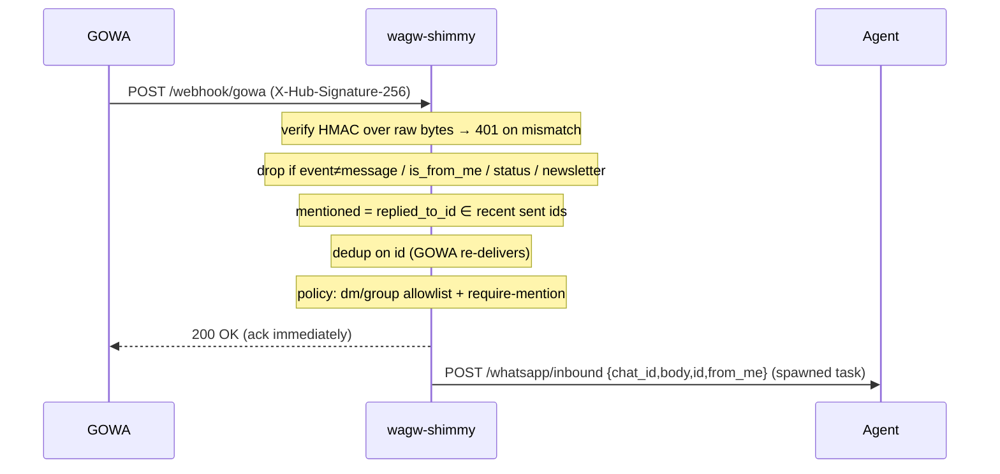
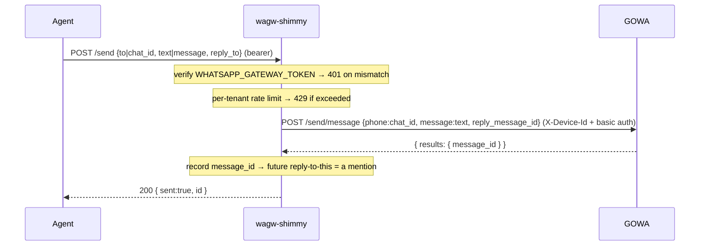

# wagw-shimmy — WhatsApp Gateway Shim (GOWA ⟷ Rust agents)

A thin Rust/axum adapter that bridges **GOWA** (`aldinokemal/go-whatsapp-web-multidevice`, built on
[whatsmeow], pinned at **v8.7.0**) to the **`spike-rust-agent`** inbound/outbound contract, applying
per-tenant policy. GOWA holds the long-lived WhatsApp socket and speaks its own REST + HMAC-webhook
dialect; the agent speaks a small `{chat_id, body, id, from_me}` contract. The shim is the only new
code between them — GOWA runs unmodified (or modified only via a thin vendored patch series).

```text
WhatsApp ⟷ GOWA :3000  ──webhook (HMAC)──▶  wagw-shimmy :8080  ──/whatsapp/inbound (bearer)──▶  agent :3001
                      ◀──/send/message────                   ◀────────/send (bearer)──────────
```

Three localhost-wired processes per tenant box (one tenant per box). GOWA owns `:3000`, the shim
`:8080`, the agent `:3001`.

## The one invariant that makes DM **and** group replies work

The shim forwards GOWA's `payload.chat_id` — the **conversation JID** — to the agent inbound, and
the agent echoes that same `chat_id` back on `/send`. That round-trip is the whole trick: a reply
goes to wherever the message came from, with no special-casing.

- `…@s.whatsapp.net` → a DM. `…@g.us` → a group.
- GOWA's `/send/message` accepts a group JID in its `phone` field, so a group reply lands in the
  group — **because** we forwarded `chat_id` (the group), not `from` (the sender). Confusing the two
  is the classic "the bot answered me in DM instead of the group" bug; the e2e test
  `reply_to_bot_summons_in_require_mention_group` asserts against exactly that regression.

`from` (the participant JID) is carried internally **only** for DM-sender allowlisting; it is never
forwarded and never used as a reply target.

## GOWA v8.7.0 webhook payload (verified against `vendor/gowa` `docs/webhook-payload.md`)

Envelope: `{ "event": "...", "device_id": "...", "payload": { … } }`. Fields the shim reads off
`payload`:

| field           | used for                                                                 |
|-----------------|--------------------------------------------------------------------------|
| `chat_id`       | conversation JID — forwarded as `chat_id`, echoed back on `/send`.       |
| `from`          | participant JID — DM allowlisting only.                                  |
| `body`          | top-level text (also media captions). **Not** `payload.message.text`.    |
| `id`            | message id — dedup key; the agent echoes it back as `reply_to`.          |
| `is_from_me`    | `true` → the bot's own echo; dropped.                                    |
| `replied_to_id` | id of the quoted message → powers reply-to-bot mention detection.        |

`status@broadcast` and `…@newsletter` chats are dropped. Deserialisation is lenient (all fields
optional, unknowns ignored) so a payload-shape drift degrades to a dropped message, not a 500.
Golden fixtures in [`tests/fixtures`](tests/fixtures) pin the exact shapes; refresh them when
bumping the pinned GOWA tag.

### HMAC scheme

GOWA signs every webhook with header `X-Hub-Signature-256: sha256=<hex>`, HMAC-SHA256 over the **raw
request body** keyed by the shared secret. The shim reads the raw bytes (axum `Bytes`, never
`Json<T>`), verifies with a constant-time compare (`Mac::verify_slice`), and returns **401** on
mismatch. Set a per-tenant `GOWA_WEBHOOK_SECRET`; boot refuses GOWA's default `secret`.

## Inbound flow (`POST /webhook/gowa`)



**Why ack-fast + async-forward + dedup.** GOWA times out each webhook delivery at **10 s** and
retries up to **5×** with exponential backoff. An agent LLM turn routinely exceeds 10 s. If the shim
blocked the webhook response on the agent, GOWA would time out → re-deliver → duplicate replies. So
the shim acks 200 the instant policy passes, forwards in a spawned (and SIGTERM-drained) task, and
drops any already-seen `id`. The e2e tests `ack_is_fast_even_when_agent_is_slow` and
`duplicate_delivery_forwards_once` prove both halves.

### "Mention" = reply-to-bot

In a require-mention group, the bot answers when a message **replies to one of its own recent
messages** (`replied_to_id` matches an id in the bounded sent-id cache). A fresh `@mention` does
*not* summon it (that would need a GOWA patch for `contextInfo.mentionedJid`, deliberately deferred).
A group listed in `WA_FREE_RESPONSE_CHATS` bypasses the requirement entirely.

## Outbound flow (`POST /send`)



GOWA **4xx** (except 429) maps to **400** `bad_request` (the agent shouldn't retry); **5xx / 429 /
timeout / connection** maps to **502** `upstream` (retryable). The agent presents `WHATSAPP_GATEWAY_TOKEN`
as a bearer; missing/wrong → 401.

## Configuration

See [`.env.example`](.env.example) for the full list. Boot is fail-fast: a missing secret, bad URL,
or unknown policy enum aborts startup. Error messages name the offending *variable*, never its value.

GOWA-side settings (set on GOWA, not the shim): webhook URL → `http://127.0.0.1:8080/webhook/gowa`,
`WHATSAPP_WEBHOOK_EVENTS=message` (filter at source), `WHATSAPP_WEBHOOK_SECRET=<GOWA_WEBHOOK_SECRET>`.
The agent's `WHATSAPP_GATEWAY_URL` points at the shim (`http://127.0.0.1:8080`).

## Build, test, lint

```sh
cargo build
cargo test                  # 27 unit + 10 e2e; no network, no WA account, no API spend
cargo clippy --all-targets  # CI-equivalent gate — keep clean
```

The e2e suite ([`tests/e2e.rs`](tests/e2e.rs)) stands up in-process mock GOWA + agent servers and
drives the real router: HMAC verify, ack-fast, dedup, the chat_id round-trip, reply-to-bot, and
bearer enforcement.

## Vendored GOWA

GOWA is vendored as a git submodule pinned to **v8.7.0**, with local patches kept as a thin commit
series on top of the tag (see [`vendor/README.md`](vendor/README.md)). CI builds it once into a
versioned binary artifact; fleet boxes install that prebuilt binary — no Go toolchain on prod.

## Fleet deploy

Self-contained provisioning lives in [`deploy/`](deploy/): per-tenant systemd units (hardened,
localhost-wired), Tailscale join (tailnet + MagicDNS + Tailscale SSH + ACLs), restic→R2 backups of
the live whatsmeow SQLite store, and the `fleetctl` operator CLI. See [`deploy/README.md`](deploy/README.md).

[whatsmeow]: https://github.com/tulir/whatsmeow
